# Hi, I'm Dagemawi Alemayehu 👋

**PHP / Laravel / WordPress / REST API / SaaS Engineer**

I build and debug production web systems—especially the parts that become difficult after basic CRUD: unfamiliar codebases, plugin conflicts, payment reconciliation, API integrations, background jobs, multi-tenant data, webhooks, database failures, and systems that need a careful fix instead of an unnecessary rewrite.

## Featured engineering work

| Project | Type | What you can verify |
|---|---|---|
| **[WP Integration Toolkit](https://github.com/DagemawiDeveloper/wordpress-plugin-development-demo)** | Executable WordPress plugin | GPL-licensed plugin architecture, REST/AJAX integration, signed webhooks, replay protection, fail-closed secret handling, bounded logs, PHPUnit, and [multi-version CI](https://github.com/DagemawiDeveloper/wordpress-plugin-development-demo/actions/workflows/php-lint.yml) |
| **[RelayHub](https://github.com/DagemawiDeveloper/laravel-api-integration-demo)** | Executable Laravel package | Laravel 12 package boundaries, deterministic idempotency, queues, retry/backoff, dead-letter handling, authenticated callbacks, lifecycle tests, and [PHP 8.2–8.4 CI](https://github.com/DagemawiDeveloper/laravel-api-integration-demo/actions/workflows/tests.yml) |
| **[Boldinone](https://github.com/DagemawiDeveloper/Boldinone)** | Executable Laravel commerce application | Local-first Stripe checkout persistence, event-ledger deduplication, checkout recovery, atomic inventory finalization, clean migrations, payment tests, audited locked dependencies, and [PHP 8.2–8.4 CI](https://github.com/DagemawiDeveloper/Boldinone/actions/workflows/quality.yml) |
| **[Commission Calculation Engine](https://github.com/DagemawiDeveloper/CommissionApp-Dagemawi)** | Executable PHP domain application | Stateful business rules, ISO-week limits, currency normalization, strict CSV validation, regression tests, repository hygiene, and [PHP CI](https://github.com/DagemawiDeveloper/CommissionApp-Dagemawi/actions/workflows/tests.yml) |
| **[SaaS Architecture Showcase](https://github.com/DagemawiDeveloper/saas-architecture-showcase)** | Architecture documentation | Sanitized decisions from multi-tenant survey/data-collection work: modular monolith design, tenant isolation, mobile idempotency, queues, object storage, observability, and failure modes |

The first four repositories contain executable source and automated verification. The architecture showcase is intentionally documentation-only because the related product source is private.

## What I work on

```text
WordPress & PHP       Plugins, hooks, AJAX, REST APIs, debugging, secure integrations
Laravel & SaaS        APIs, queues, multi-tenancy, dashboards, domain workflows
API Integrations      HMAC webhooks, retries, idempotency, reconciliation, audit trails
Commerce & Payments   Checkout state, signed callbacks, transactions, inventory safety
Databases             MySQL/MariaDB, schemas, migrations, indexes, locking, debugging
Mobile                Flutter applications connected to Laravel APIs
```

## How I approach a difficult system

```mermaid
flowchart LR
    ISSUE[Problem / Requirement] --> REPRO[Reproduce]
    REPRO --> TRACE[Trace actual flow]
    TRACE --> ROOT[Find root cause]
    ROOT --> OPTIONS[Compare trade-offs]
    OPTIONS --> BUILD[Make smallest safe change]
    BUILD --> VERIFY[Test + observe]
    VERIFY --> REVIEW[PR + review]
    REVIEW --> DOC[Document handoff]
```



My default engineering priorities are:

1. **Correctness before cleverness**
2. **Security controls that fail closed**
3. **Observable integrations instead of silent failures**
4. **Idempotent, retry-safe webhooks and background work**
5. **Explicit tenant and authorization boundaries**
6. **Transactions and reconciliation for payment and inventory state**
7. **Maintainable extension points instead of core or theme hacks**
8. **Architecture that fits the real product, team, and traffic**

## Public engineering standards

The featured code repositories include the evidence needed for review:

- recognized open-source licenses;
- setup, architecture, security, and failure-mode documentation;
- automated tests run in GitHub Actions;
- issue → branch → pull request workflows;
- focused commits and reviewable changes;
- CI checks for dependencies, migrations, syntax, tests, and obvious secret patterns;
- explicit boundaries between public samples and private production work.

I do not present my own repository pull requests as external open-source contributions. Contributing useful fixes upstream to established projects is a separate goal I am actively working toward.

## Selected production experience

A large part of my current work is private. It includes:

- multi-tenant Laravel SaaS platforms;
- survey and field-data workflows with web and Flutter clients;
- geofenced operations and dynamic forms;
- role-based access, OTP, and mobile API flows;
- analytics and AI-assisted product capabilities;
- WordPress and Joomla extensions;
- payment, hosting, DNS, and third-party service integrations;
- debugging and extending systems I did not originally build.

For proprietary products and client work, I publish sanitized architecture decisions or reference implementations instead of exposing customer source, credentials, or business data.

## Remote delivery

My freelance work has trained me to investigate incomplete requirements, communicate progress asynchronously, explain trade-offs, and deliver production changes for clients in other countries.

- Upwork: [Dagemawi Alemayehu](https://www.upwork.com/freelancers/dagemawialemayehu)
- GitHub: [DagemawiDeveloper](https://github.com/DagemawiDeveloper)

---

**Core stack:** PHP · Laravel · WordPress · MySQL/MariaDB · JavaScript · REST APIs · Stripe · Flutter
