# Hi, I'm Dagemawi Alemayehu 👋

**PHP / Laravel / WordPress / REST API / SaaS Engineer**

I build and debug production web systems—especially the parts that become difficult after basic CRUD: existing codebases, plugin conflicts, payment reconciliation, API integrations, background jobs, multi-tenant data, webhooks, database failures, and systems that need a careful fix instead of an unnecessary rewrite.

## Engineering evidence

| Project | What the repository proves |
|---|---|
| **[WP Integration Toolkit](https://github.com/DagemawiDeveloper/wordpress-plugin-development-demo)** | Installable GPL WordPress plugin; REST/AJAX integration; authenticated webhooks with replay protection; fail-closed secret encryption; bounded logging; PHPUnit and multi-version CI |
| **[RelayHub](https://github.com/DagemawiDeveloper/laravel-api-integration-demo)** | Laravel package boundaries; queues; deterministic idempotency; retries/backoff; dead-letter handling; inbound/outbound webhook authentication; lifecycle tests and CI |
| **[Boldinone](https://github.com/DagemawiDeveloper/Boldinone)** | Laravel commerce application; server-authoritative pricing; Stripe signature verification; durable-order reconciliation; row locks; retry-safe inventory finalization; PHPUnit in CI |
| **[Commission Calculation Engine](https://github.com/DagemawiDeveloper/CommissionApp-Dagemawi)** | Framework-independent PHP domain modeling; stateful weekly business rules; currency normalization; regression tests; reproducible Composer install and repository-hygiene CI |
| **[SaaS Architecture Showcase](https://github.com/DagemawiDeveloper/saas-architecture-showcase)** | Anonymized ADRs from multi-tenant survey/data-collection work: modular monolith, tenant isolation, idempotent mobile submissions, object storage, queue boundaries and failure modes |
| **[Telebirr PHP Reference](https://github.com/DagemawiDeveloper/Telebirr)** | Lower-level payment integration, RSA signing, runtime secret configuration, TLS verification, full-history Gitleaks scanning and PHP quality checks |

## What I work on

```text
WordPress & PHP       Plugin development, troubleshooting, hooks, AJAX, REST APIs
Laravel & SaaS        Backend architecture, APIs, queues, multi-tenancy, dashboards
API Integrations      Webhooks, HMAC signing, retries, idempotency, external services
Commerce & Payments   Checkout workflows, signed callbacks, reconciliation, inventory
Databases             MySQL/MariaDB, schema design, migrations, transactions, debugging
Mobile                Flutter applications connected to Laravel APIs
```

## How I approach a difficult system

```mermaid
flowchart LR
    ISSUE[Problem / Requirement] --> REPRO[Reproduce]
    REPRO --> TRACE[Trace actual flow]
    TRACE --> ROOT[Find root cause]
    ROOT --> OPTIONS[Compare trade-offs]
    OPTIONS --> BUILD[Make smallest safe change]
    BUILD --> VERIFY[Test + observe]
    VERIFY --> REVIEW[PR + review]
    REVIEW --> DOC[Document handoff]
```



My default engineering priorities are:

1. **Correctness before cleverness**
2. **Security controls that fail closed**
3. **Observable integrations instead of silent failures**
4. **Idempotent, retry-safe webhooks and background work**
5. **Explicit tenant and authorization boundaries**
6. **Transactions and reconciliation for payment/inventory state**
7. **Maintainable extension points instead of core/theme hacks**
8. **Practical architecture that fits the real team and traffic**

## Public engineering standards

The featured repositories are maintained as reviewable engineering samples rather than screenshots or opaque archives. Depending on the project, they include:

- recognized open-source licenses;
- installation and architecture documentation;
- automated tests executed in GitHub Actions;
- pull-request workflows and focused commits;
- secret-pattern/history scanning for payment integrations;
- generated-dependency and local-artifact checks;
- security and failure-mode documentation;
- explicit notes where production code remains private.

Older empty or ZIP-only repositories are marked clearly as historical so they are not confused with current work.

## Selected production experience

A large part of my current production work is private. It includes:

- multi-tenant Laravel SaaS platforms;
- survey and field-data workflows with web and Flutter clients;
- geofenced operations and dynamic forms;
- role-based access, OTP and mobile API flows;
- analytics and AI-assisted product capabilities;
- WordPress/Joomla extensions and existing-codebase debugging;
- payment, hosting, DNS and third-party service integrations.

For client and proprietary product work, I publish sanitized architecture decisions or reference implementations instead of exposing customer source, credentials, or business data.

## Work with me

I’m best suited for work where someone needs to understand an existing system, communicate clearly about risk and trade-offs, debug at code level, integrate external services, and leave the codebase easier to operate afterward.

- Upwork: [Dagemawi Alemayehu](https://www.upwork.com/freelancers/dagemawialemayehu)
- GitHub: [DagemawiDeveloper](https://github.com/DagemawiDeveloper)

---

**Core stack:** PHP · Laravel · WordPress · MySQL/MariaDB · JavaScript · REST APIs · Stripe · Flutter
