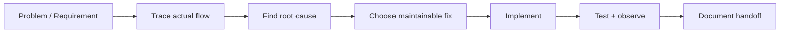

# Hi, I'm Dagemawi Alemayehu 👋

**PHP / Laravel / WordPress / REST API / SaaS Engineer**

I build and debug production web systems—especially the parts that become difficult once a project moves beyond basic CRUD: plugin conflicts, API integrations, background jobs, multi-tenant data, webhooks, database issues, and existing systems that need careful troubleshooting instead of a rewrite.

## What I work on

```text
WordPress & PHP       Plugin development, troubleshooting, hooks, AJAX, REST APIs
Laravel & SaaS        Backend architecture, APIs, queues, multi-tenancy, dashboards
API Integrations      Webhooks, HMAC signing, retries, idempotency, external services
Databases             MySQL, schema design, migrations, query/debugging work
Frontend Integration  JavaScript, responsive admin/product interfaces
Mobile                 Flutter apps connected to Laravel APIs
```

## Featured engineering showcases

| Project | What it demonstrates |
|---|---|
| **[WP Integration Toolkit](https://github.com/DagemawiDeveloper/wordpress-plugin-development-demo)** | WordPress plugin architecture, REST endpoints, AJAX, signed webhooks, encrypted settings, logging and retry workflows |
| **[RelayHub](https://github.com/DagemawiDeveloper/laravel-api-integration-demo)** | Laravel API integrations, queues, HMAC webhooks, idempotency, retries, dead-letter handling and tests |
| **[SaaS Architecture Showcase](https://github.com/DagemawiDeveloper/saas-architecture-showcase)** | Multi-tenant architecture, security, queue design, observability, deployment and failure-mode decisions |

## The kind of problems I like solving

- “This WordPress/WooCommerce plugin setting refuses to save.”
- “Our API integration works sometimes, but retries create duplicate records.”
- “We need to receive and verify webhooks securely.”
- “This Laravel job/API is failing in production and we need the real cause.”
- “Our SaaS needs tenant isolation, queues, roles and a maintainable backend structure.”
- “The existing codebase works, but adding features is becoming risky.”

I prefer to trace the actual failure path, make the smallest safe change, and leave the codebase easier to operate afterward.

## Architecture mindset



My default engineering priorities are:

1. **Correctness before cleverness**
2. **Observable integrations instead of silent failures**
3. **Idempotent/retry-safe background work**
4. **Clear tenant and authorization boundaries**
5. **Maintainable extension points instead of core/theme hacks**
6. **Practical solutions that fit the existing system**

## Selected production experience

A large part of my current production work is private. It includes:

- Multi-tenant SaaS platforms with Laravel backends
- Survey/data-collection workflows with web and Flutter clients
- Geofenced field operations and dynamic forms
- API and automation services
- AI-assisted analytics and developer tooling
- WordPress, landing-page and external-data integrations

For private client/product work, I publish sanitized architecture and reference implementations rather than exposing proprietary source code.

## Public repositories

You can also find older public work here around Laravel, payment integrations, media systems and application prototypes. The featured repositories above are the best starting point if you're evaluating my current backend/WordPress engineering style.

## Work with me

I’m best suited for projects where you need someone who can **understand an existing system, debug it at code level, integrate external services, and ship a maintainable fix**.

- Upwork: [Dagemawi Alemayehu](https://www.upwork.com/freelancers/dagemawialemayehu)
- GitHub: [DagemawiDeveloper](https://github.com/DagemawiDeveloper)

---

**Core stack:** PHP · Laravel · WordPress · MySQL · JavaScript · REST APIs · Flutter
